# Basketball Card Pricing Model

---

## Purpose

Build a **pricing model** for graded 2018 basketball cards using 100,000 historical transaction records, comparing a **non-ML** baseline against a **machine learning** approach to **predict the next transaction price** of a card.

### Discussion Points

- How would you generate a **confidence interval** for your prediction?
- What are the **shortcomings** of your approach?
- What **features would you engineer** if you had more time?
- Would your **model improve with 10x the data? 100x?**
- How did/would you deal with **lookahead bias**?
- How did/would you deal with **overfitting**?

## Pipeline Overview

```
┌─────────────┐     ┌──────────────┐     ┌──────────────────┐     ┌────────────────┐     ┌──────────────┐     ┌──────────────┐
│     EDA      │────▶│  Data Split  │────▶│ Preprocessing/FE │────▶│ Non-ML Baseline│────▶│   ML Model   │────▶│  Model Eval  │
└─────────────┘     └──────────────┘     └──────────────────┘     └────────────────┘     └──────────────┘     └──────────────┘
```

**EDA** — Explore the distribution of prices, grades, brands, and players to understand data quality and market dynamics.

**Data Split** — Partition the data chronologically into train/validation/test sets to prevent lookahead bias.

**Preprocessing/FE** — Normalize text, impute missing values, and engineer aggregate price/count features per card, player, and brand.

**Non-ML Baseline** — Establish a performance floor using a cascading lookup strategy from exact card match to global median.

**ML Model** — Train an XGBoost gradient-boosted tree on the 13 engineered features to predict log-transformed sale price.

**Model Eval** — Compare the ML model against the baseline across MAE, median AE, and R-squared on the held-out test set.

---

## Abstract

This study develops and evaluates a machine learning pipeline for estimating the sale price of graded 2018 basketball cards using 100,000 historical transaction records. We compare an XGBoost gradient-boosted tree model against a non-ML lookup-based baseline that cascades from exact card match to increasingly broad fallback strategies. **Our findings indicate that the simple lookup baseline outperforms the XGBoost model across all evaluation metrics**, achieving a median absolute error of $40.49 compared to $57.75 for the ML model. These results suggest that for fungible collectibles with sufficient transaction history, **historical price lookup remains a highly competitive strategy that is difficult to surpass with standard supervised learning approaches**.

> **Terminology note**: Throughout this document, **"txn"** is shorthand for **"transaction"** — a single recorded sale of a card at a specific price and date.

---

## Table of Contents

- [1. Data Description](#1-data-description)
- [2. Exploratory Data Analysis](#2-exploratory-data-analysis)
- [3. Data Splitting Strategy](#3-data-splitting-strategy)
- [4. Feature Engineering](#4-feature-engineering)
- [5. Non-ML Baseline](#5-non-ml-baseline)
- [6. XGBoost Model Training](#6-xgboost-model-training)
- [7. Model Evaluation](#7-model-evaluation)
- [8. Infrastructure](#8-infrastructure)
- [9. Discussion](#9-discussion)

---

## 1. Data Description

The dataset contains **100,000 sales records** of graded basketball cards from 2018, spanning **May 2018 through February 2022**.

Each record captures the following fields:

| Field | Description |
|---|---|
| `year` | The year the card was produced (always 2018) |
| `subject` | The player on the card (e.g., LeBron James) |
| `brand` | The card manufacturer (e.g., Panini Prizm) |
| `variety` | The specific variant (e.g., "Silver", or null for base cards) |
| `card_number` | The number printed on the card |
| `date` | The date of the sale |
| `price` | The sale price in USD (the prediction target) |
| `grade` | The condition rating (1–10 scale) |
| `grading_company` | The grading authority (PSA, BGS, SGC, etc.) |

Cards are considered fungible when they share the same year, subject, brand, variety, card number, grade, and grading company. This combination is referred to as the **card key** throughout this analysis.

**Source**: `s3://assessment-alt/00_data_collection/transaction_data.csv`

---

## 2. Exploratory Data Analysis

> **Notebook**: [`01_eda/notebook.ipynb`](01_eda/notebook.ipynb)

### 2.1 Target Variable Distribution

<p align="center">
  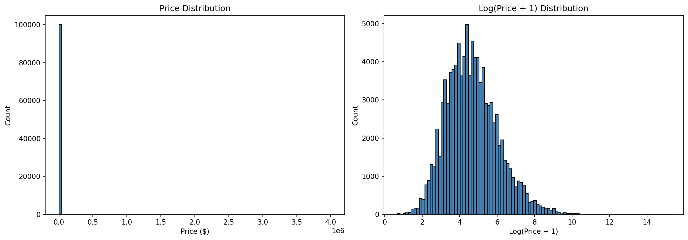
</p>

**Figure 2.1.** Distribution of sale prices before (left) and after (right) log transformation. The raw price distribution is heavily right-skewed, with the majority of transactions concentrated below $100 while a small number of sales exceed $100,000. The median sale price is $95, the mean is $460, and the maximum observed price is $4 million. After applying a log(price + 1) transformation, the distribution approximates a normal shape, making it more suitable for regression modeling. This transformation is applied to the target variable throughout the modeling pipeline.

### 2.2 Grade Distribution

<p align="center">
  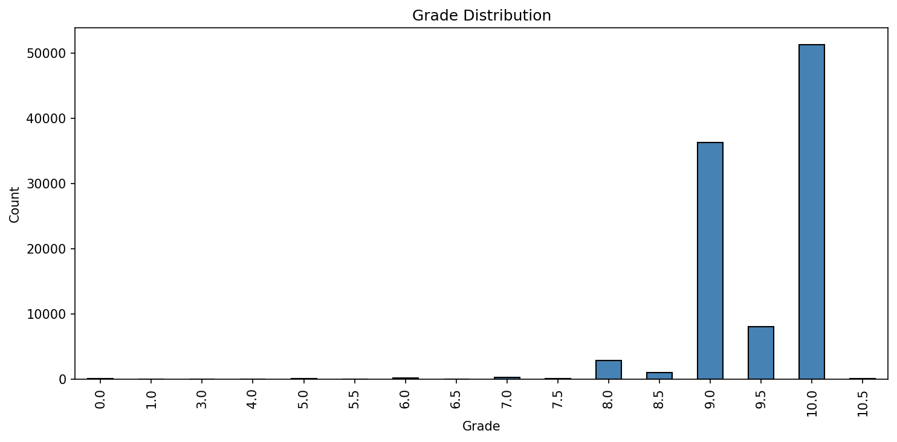
</p>

**Figure 2.2.** Frequency of transactions by card grade. Grade 10 (gem mint) accounts for approximately 51% of all transactions, and Grade 9 accounts for another 36%. Grades below 8 are exceedingly rare in the dataset, collectively representing less than 1% of sales. This concentration indicates that the secondary market for graded basketball cards is dominated by high-condition specimens, and model performance on lower grades should be interpreted with caution given the limited sample sizes.

### 2.3 Grading Company Distribution

<p align="center">
  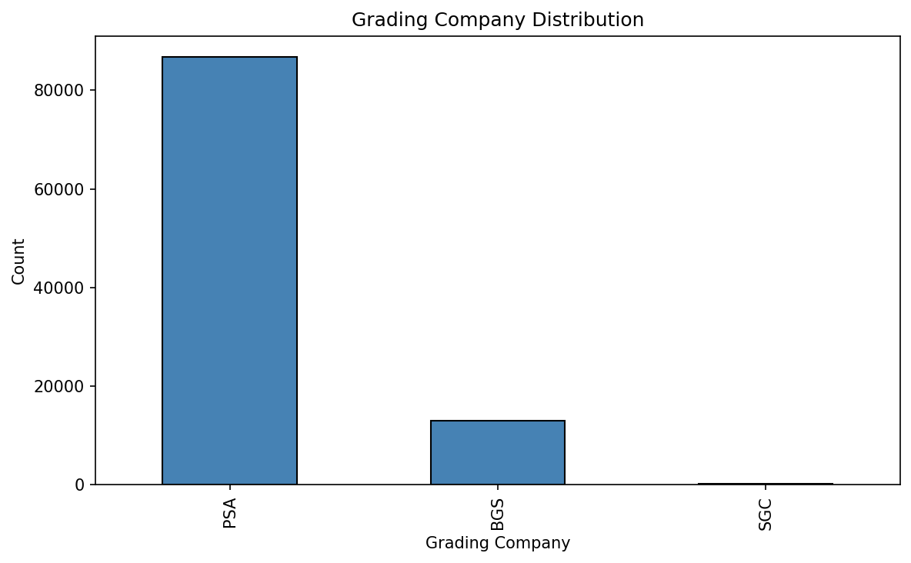
</p>

**Figure 2.3.** Proportion of transactions by grading company. PSA (Professional Sports Authenticator) accounts for 87% of all graded card sales, with BGS (Beckett Grading Services) representing nearly all of the remainder at 13%. SGC and other grading companies appear only in trace quantities. This imbalance reflects PSA's dominant market position in sports card authentication during this period.

### 2.4 Price Distribution by Grade

<p align="center">
  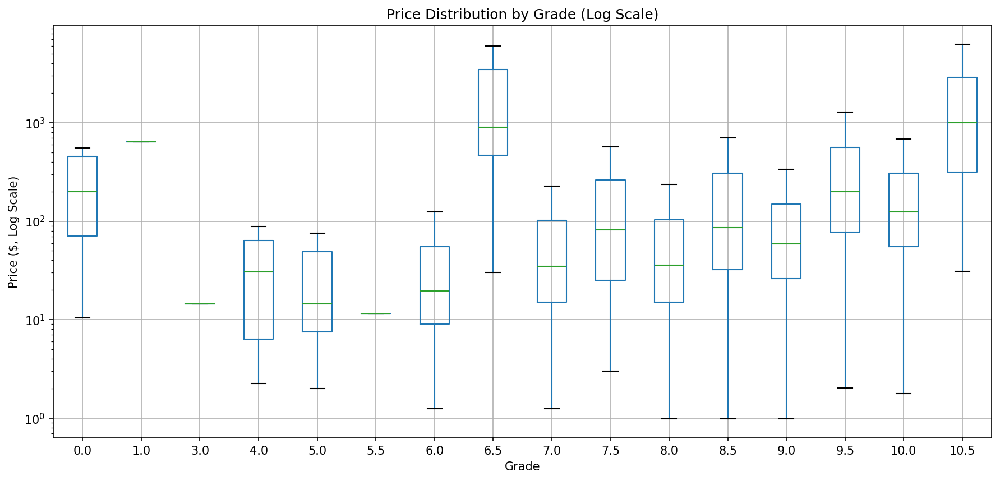
</p>

**Figure 2.4.** Box plots of sale price by grade, displayed on a logarithmic scale (outliers excluded). A clear positive relationship between grade and price is observed: higher-graded cards command substantially higher prices. Grade 10 cards exhibit the widest interquartile range, reflecting the diversity of players and brands within that grade tier. Notably, even within a single grade, prices span multiple orders of magnitude, indicating that grade alone is insufficient to predict price — card identity (player, brand, variety) plays a critical role.

### 2.5 Price Distribution by Grading Company

<p align="center">
  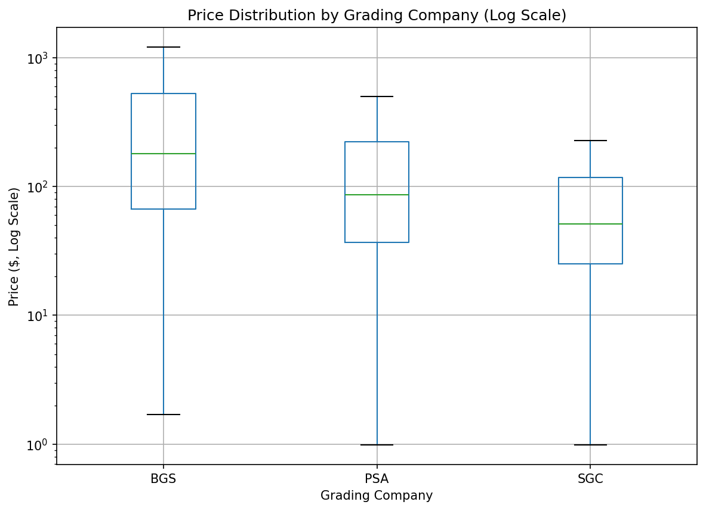
</p>

**Figure 2.5.** Box plots of sale price by grading company on a logarithmic scale. PSA-graded cards exhibit a higher median price and wider price range compared to BGS-graded cards. This premium may reflect both collector preference for PSA holders and compositional differences in the types of cards submitted to each grading service. SGC-graded cards appear in too few transactions to draw reliable conclusions.

### 2.6 Transaction Volume Over Time

<p align="center">
  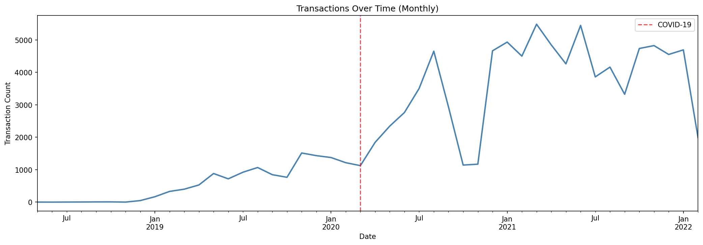
</p>

**Figure 2.6.** Monthly transaction volume from May 2018 to February 2022, with the dashed red line marking the onset of the COVID-19 pandemic in March 2020. Transaction volume remained relatively low and stable through 2019, then surged dramatically beginning in mid-2020, peaking in early 2021 before declining through the end of the observation period. This pattern is consistent with the widely documented COVID-era collectibles boom, during which stimulus payments, increased leisure time, and heightened media attention drove a significant influx of buyers into the sports card market. This temporal nonstationarity poses a challenge for modeling, as the market environment changed substantially within the dataset's timeframe.

### 2.7 Top Subjects by Transaction Count

<p align="center">
  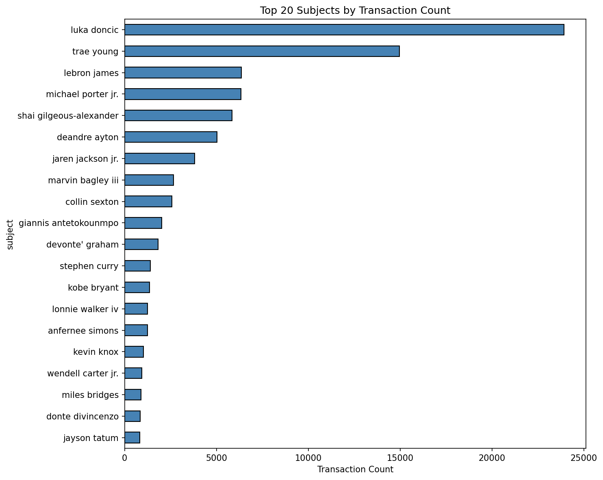
</p>

**Figure 2.7.** The 20 most frequently transacted players (subjects) in the dataset. Luka Doncic leads with approximately 14,000 transactions, followed by Trae Young and Deandre Ayton — all members of the 2018 NBA draft class. The distribution exhibits a long tail: the top 5 players account for a disproportionate share of total volume, while hundreds of other players appear infrequently. This concentration means the model will have substantially more training signal for popular rookies than for veteran or niche players.

### 2.8 Top Brands by Transaction Count

<p align="center">
  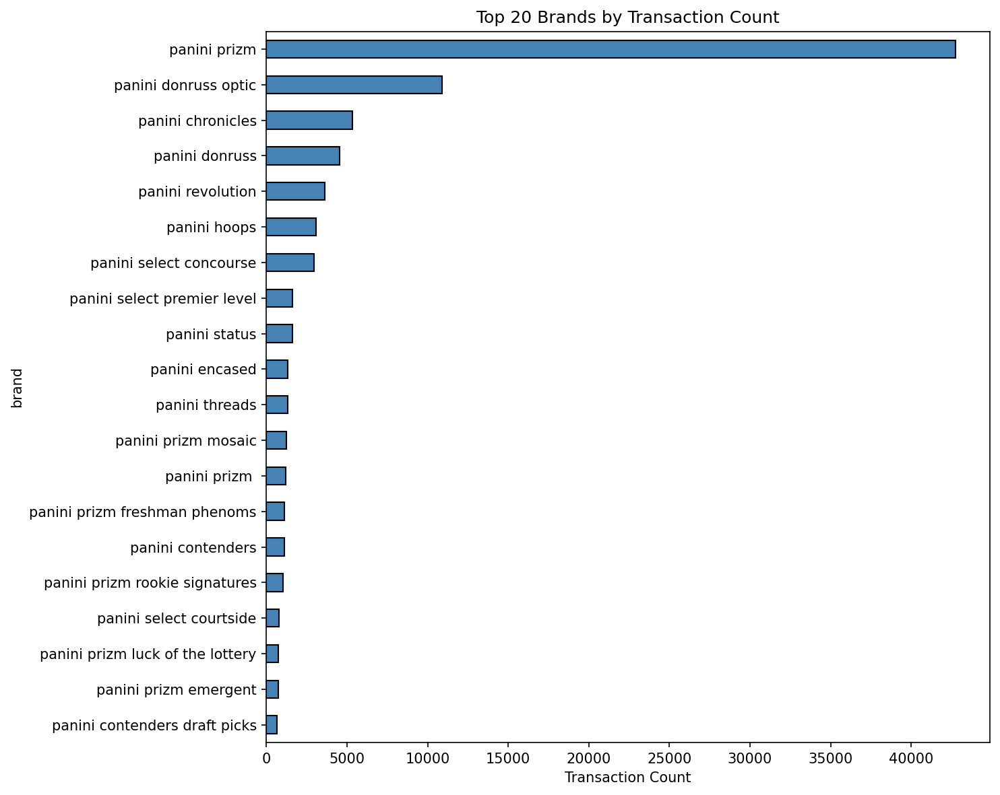
</p>

**Figure 2.8.** The 20 most frequently transacted card brands. Panini Prizm dominates with roughly 15,000 transactions, followed by Panini Donruss Optic and Panini Select. Panini's product lines collectively account for the vast majority of transactions, consistent with the company's exclusive licensing agreement with the NBA during this period. Lower-volume brands appear in the long tail, where sparse data may limit model accuracy.

### 2.9 Median Price Over Time for Top Players

<p align="center">
  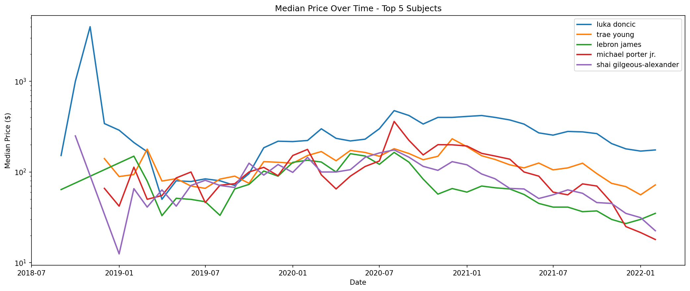
</p>

**Figure 2.9.** Monthly median sale prices for the five most frequently transacted players, plotted on a logarithmic scale. All five players exhibit a common pattern: prices rose sharply during the 2020–2021 boom period and declined thereafter. Luka Doncic's cards consistently command the highest median prices, peaking above $1,000, while the remaining players cluster at lower price points. The synchronized rise and fall across players suggests that macro-market forces (speculation, pandemic-driven demand) drove price movements more than individual player performance during this period.

### 2.10 Missing Values

<p align="center">
  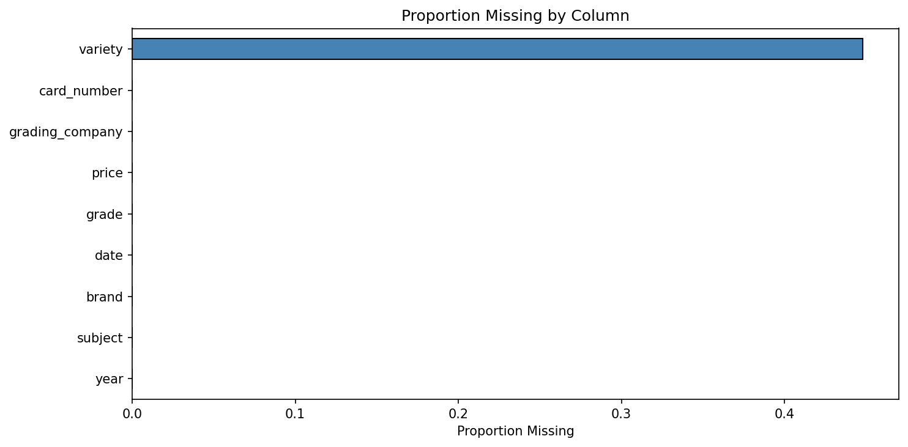
</p>

**Figure 2.10.** Proportion of missing values by column. The `variety` field is the only column with substantial missingness, at approximately 45%. All other fields are complete. The missing variety values correspond to base cards (i.e., cards with no special variant), and are filled with the string "base" during preprocessing.

### 2.11 Variety Analysis

<p align="center">
  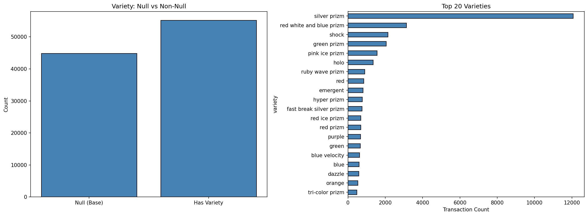
</p>

**Figure 2.11.** Left: count of transactions with null versus non-null variety fields. Right: the 20 most common named varieties. Approximately 45% of all transactions are base cards (null variety), while the remaining 55% include named variants such as "Silver Prizm," "Rated Rookie," and various color parallels. Named varieties are important price differentiators — rare parallels (e.g., Gold, Black) can command significant premiums over their base counterparts.

### 2.12 Data Quality Issues

Text normalization analysis revealed **231 duplicate subjects** and **139 duplicate brands** caused by inconsistent capitalization (e.g., "LeBron James" vs. "LEBRON JAMES"). These are resolved by lowercasing and stripping whitespace during preprocessing to ensure accurate card key construction.

---

## 3. Data Splitting Strategy

> **Notebook**: [`02_data_split/notebook.ipynb`](02_data_split/notebook.ipynb)

The data was split **chronologically** (not randomly) to simulate real-world deployment conditions, where the model must predict future sale prices using only historical information. This prevents lookahead bias — the inadvertent use of future information during training.

| Split | Date Range | Transactions | Percentage |
|---|---|---|---|
| Training | May 2018 – May 2021 | 62,407 | 62% |
| Validation | June – October 2021 | 21,535 | 22% |
| Test | November 2021 – February 2022 | 16,058 | 16% |

<p align="center">
  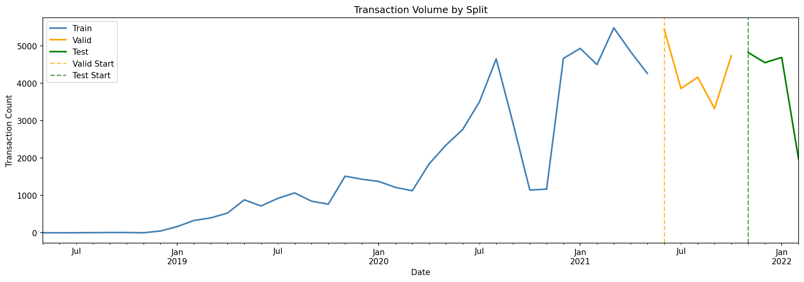
</p>

**Figure 3.1.** Monthly transaction volume colored by data split, with dashed vertical lines indicating the validation and test set boundaries. The training set captures the full pre-boom and boom periods through May 2021. The validation and test sets cover the post-peak market decline, requiring the model to generalize to a market environment it has not directly observed during training. Grade and grading company distributions remain relatively stable across splits, but median prices shift downward in the later periods due to the cooling market.

<p align="center">
  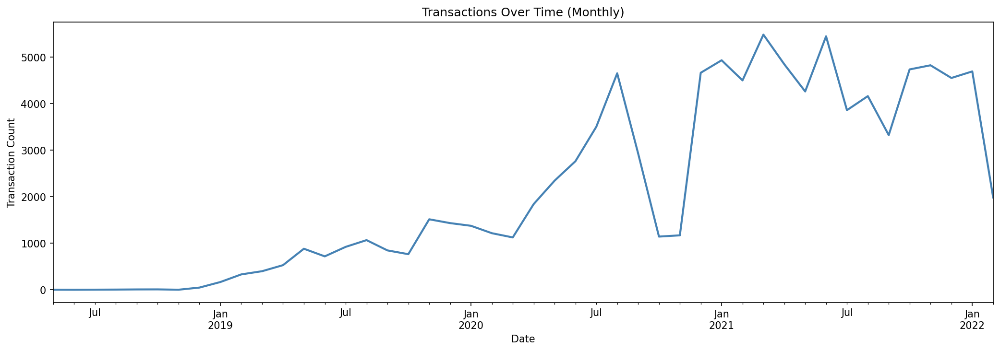
</p>

**Figure 3.2.** Overall transaction volume over time, confirming the temporal structure of the dataset. The sharp increase and subsequent decline in transaction volume are clearly visible, providing context for the challenge of temporal generalization inherent in the out-of-time split.

---

## 4. Feature Engineering

> **Notebook**: [`03_preprocessing/notebook.ipynb`](03_preprocessing/notebook.ipynb)

Raw fields such as player names and brand strings cannot be fed directly into a tree-based model. A preprocessing pipeline consisting of **8 transformers** converts the raw data into 13 numeric features and a log-transformed price target.

| Transformer | Description |
|---|---|
| **TextNormalizer** | Lowercases text, strips whitespace, fills missing variety with "base" |
| **CardKeyFeatures** | Computes transaction count and median/mean price per unique card key from training data |
| **SubjectFeatures** | Computes transaction count and median price per player from training data |
| **BrandFeatures** | Computes transaction count and median price per brand from training data |
| **GradeFeatures** | Encodes grade numerically, flags PSA grading, flags gem mint (grade 10) |
| **TimeFeatures** | Extracts sale year, month, and days since the first transaction in the dataset |
| **TargetTransform** | Applies log(price + 1) to the target variable |
| **PrepareFeatures** | Selects the final 13 feature columns for modeling |

All stateful transformers (CardKey, Subject, Brand) are fit exclusively on training data. Validation and test sets receive transform-only operations using the training-derived statistics, preventing information leakage. The fitted pipeline is persisted as a `.joblib` file for consistent reuse.

---

## 5. Non-ML Baseline

> **Notebook**: [`04_price_estimator/notebook.ipynb`](04_price_estimator/notebook.ipynb)

Before applying machine learning, a lookup-based baseline was constructed to establish a performance floor. The approach uses a priority cascade:

1. **Exact match** — Use the most recent prior sale of the same card key (covers 78.6% of test cards)
2. **Subject + grade median** — Median price of all training sales with the same player and grade (covers 99.2%)
3. **Subject median** — Median price for the player across all grades (covers 99.8%)
4. **Global median** — Overall median price from training (covers 100%)

<p align="center">
  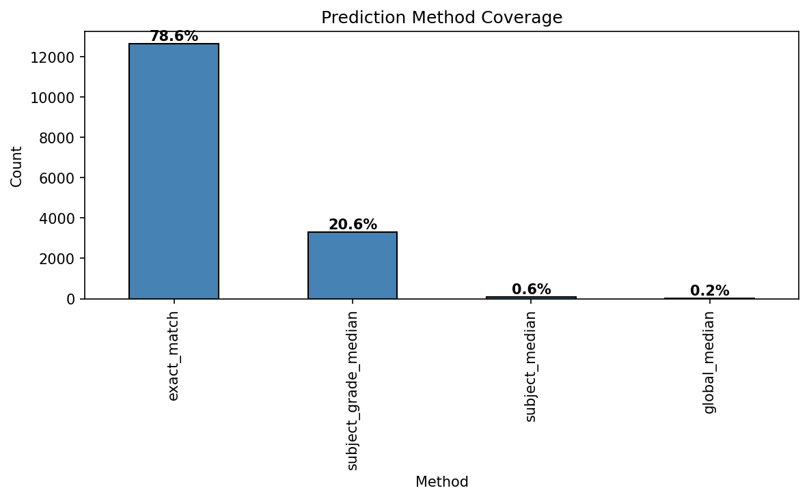
</p>

**Figure 5.1.** Distribution of prediction methods used by the cascade baseline on the test set. The exact match method covers the majority of test cards (78.6%), with subject+grade median serving as the primary fallback for previously unseen cards (20.6%). Subject-only median and global median fallbacks are rarely invoked (0.6% and 0.2%, respectively), indicating that the combination of player and grade provides sufficient coverage for nearly all test observations.

<p align="center">
  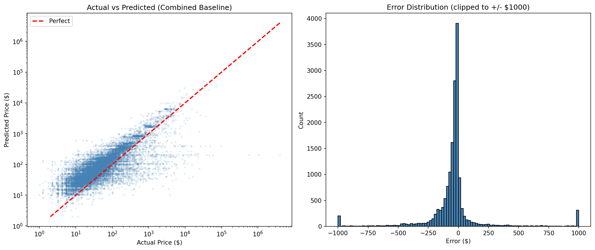
</p>

**Figure 5.2.** Left: actual versus predicted prices for the combined baseline on a log-log scale, with the red dashed line indicating perfect prediction. Points cluster near the diagonal for mid-range prices ($10–$1,000), indicating reasonable accuracy in this range. However, the baseline systematically underpredicts high-value cards and compresses its predictions relative to the true price range. Right: distribution of prediction errors clipped to +/- $1,000, showing a roughly symmetric distribution centered near zero with a slight positive skew (the model tends to underpredict more than it overpredicts).

| Method | N | MAE | Median AE | R-squared |
|---|---|---|---|---|
| Exact Match Only | 12,625 | $158.72 | $39.00 | 0.64 |
| Combined (all fallbacks) | 16,058 | $571.43 | $40.49 | 0.0007 |

The exact match method alone achieves strong performance (R-squared = 0.64, median error = $39) but is limited to cards with prior sales history. The combined cascade covers all test cards but produces a near-zero R-squared, as the broader fallback methods dilute the accuracy of exact match predictions.

---

## 6. XGBoost Model Training

> **Notebook**: [`05_model/notebook.ipynb`](05_model/notebook.ipynb)

An XGBoost gradient-boosted tree model was trained on the 13 engineered features, predicting the log-transformed price.

### Model Configuration

| Parameter | Value | Rationale |
|---|---|---|
| Max boosting rounds | 1,000 | Upper bound; early stopping determines the actual count |
| Learning rate | 0.05 | Conservative rate for improved generalization |
| Max tree depth | 6 | Moderate per-tree complexity |
| Min child weight | 30 | Prevents splits on small subgroups |
| Subsample | 80% | Row-level randomization to reduce overfitting |
| Column sample | 80% | Feature-level randomization to reduce overfitting |
| Early stopping patience | 100 rounds | Stops training when validation error plateaus |

### Training Outcome

The model triggered early stopping at **round 18 of 1,000**, indicating rapid overfitting. RMSE on the log-price scale:

- **Training**: 0.62
- **Validation**: 1.06
- **Test**: 1.32

The substantial gap between training and validation/test error confirms that the model memorized training patterns rather than learning generalizable relationships. The likely cause is the card-level price features (median/mean from training), which act as near-direct answers for previously seen cards but are zero-valued for unseen cards — creating a bimodal prediction problem.

> **Note**: Hyperparameter tuning and feature selection (e.g., RFE) were not performed in this iteration due to time constraints. Both represent natural next steps.

---

## 7. Model Evaluation

> **Notebook**: [`06_model_eval/notebook.ipynb`](06_model_eval/notebook.ipynb)

### 7.1 Overall Test Set Performance

| Metric | Value |
|---|---|
| Mean Absolute Error (MAE) | $586.69 |
| Median Absolute Error | $57.75 |
| MAPE | 192.47% |
| R-squared | -0.0001 |

The negative R-squared indicates that the model does not explain variance in sale prices beyond what a constant mean prediction would achieve.

### 7.2 Actual vs. Predicted

<p align="center">
  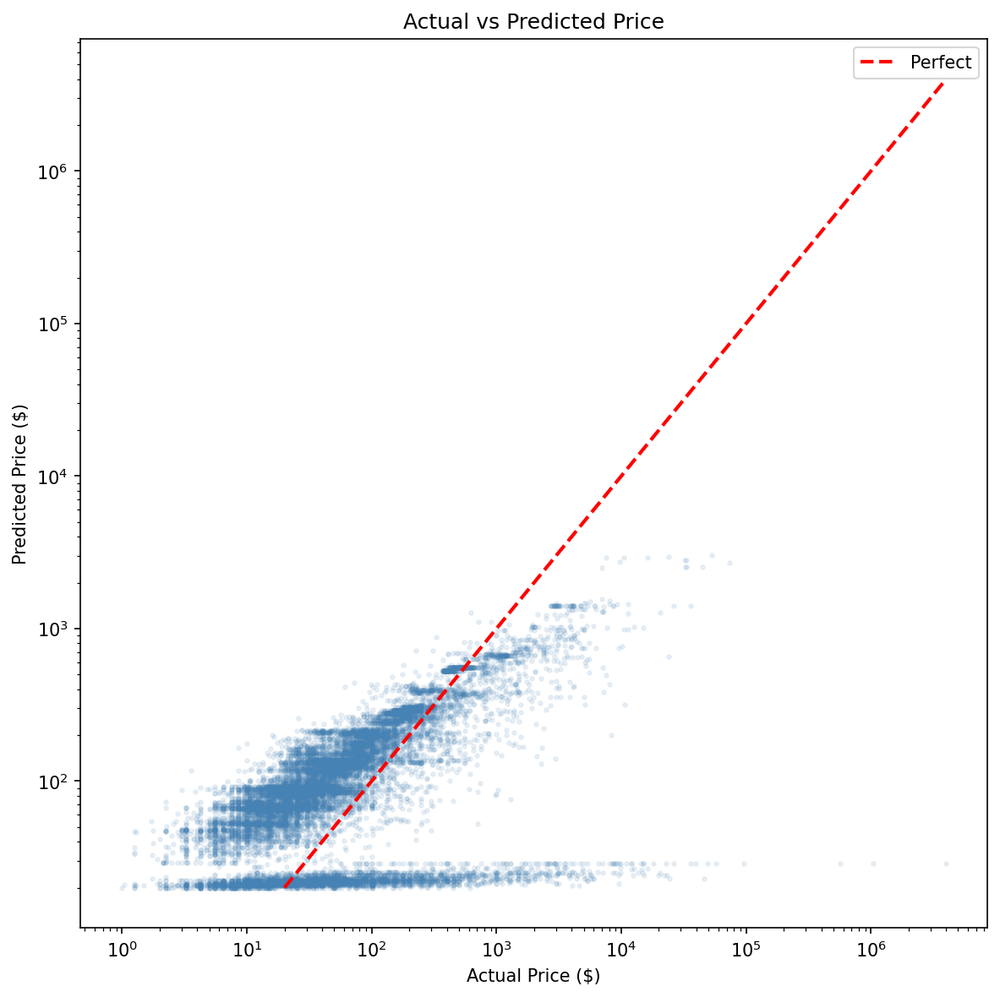
</p>

**Figure 7.2.** Actual versus predicted prices on a log-log scale. The model compresses its prediction range to approximately $20–$3,000, while actual prices span from under $1 to over $4 million. For cards in the $50–$500 range, predictions cluster loosely around the diagonal, but the model systematically underpredicts high-value cards and overpredicts low-value cards. The narrow prediction band reflects the model's inability to capture the full range of price variation in the data.

### 7.3 Residual Analysis

<p align="center">
  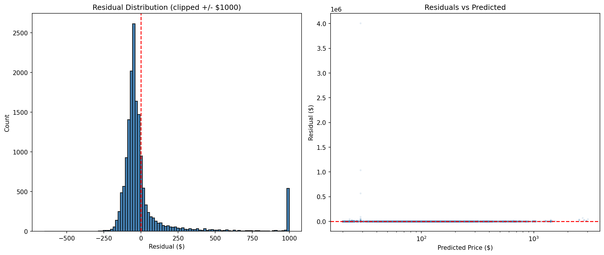
</p>

**Figure 7.3.** Left: distribution of residuals (actual minus predicted) clipped to +/- $1,000. The distribution is approximately centered at zero but exhibits heavy positive tails, indicating that large underpredictions (actual >> predicted) are more common than large overpredictions.
### 7.4 Error by Grade

<p align="center">
  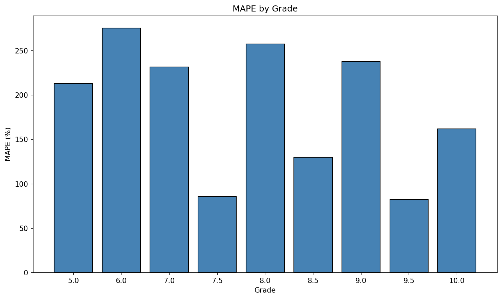
</p>

**Figure 7.4.** Mean Absolute Percentage Error (MAPE) by card grade. Lower grades (6.0, 7.0) exhibit extremely high MAPE, driven by small sample sizes and the tendency for low absolute-dollar errors to produce large percentage errors on inexpensive cards. Grade 9 and 10 cards — which constitute the vast majority of transactions — show more moderate MAPE values, though still exceeding 100% in most cases.

### 7.5 Error by Price Range

<p align="center">
  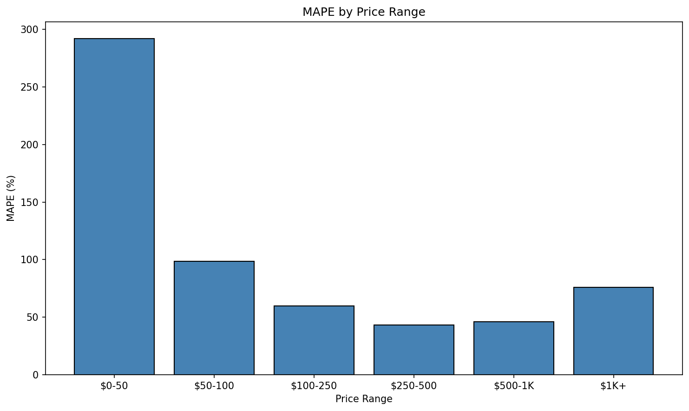
</p>

**Figure 7.5.** MAPE by actual price range. Cards in the $0–$50 range exhibit the highest MAPE (exceeding 250%), because even modest absolute-dollar prediction errors produce large percentage errors on low-priced items. As actual prices increase, MAPE generally decreases, with the $500–$1K and $1K+ ranges showing the lowest MAPE. However, these higher-value bins also have larger absolute errors, reflecting the difficulty of predicting prices for rare, high-value cards.

### 7.6 Feature Importance

<p align="center">
  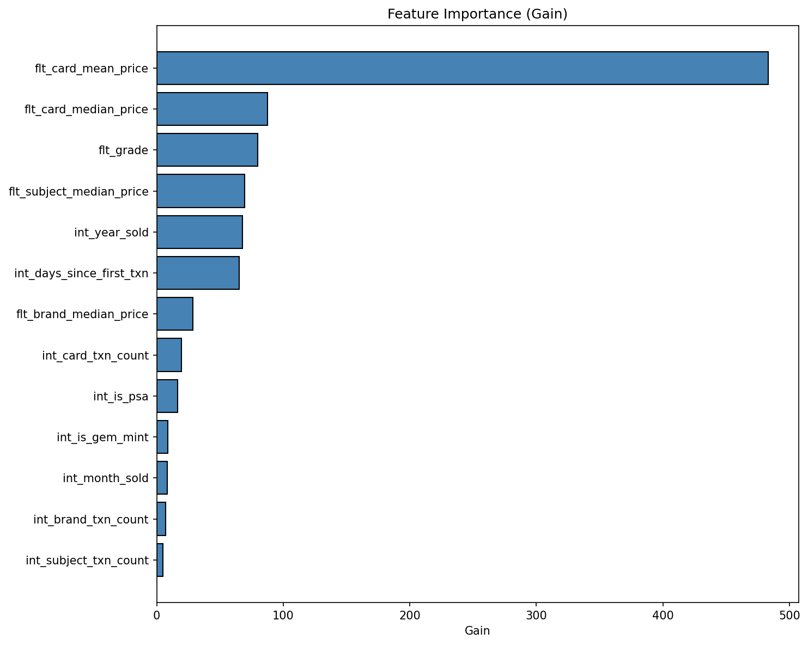
</p>

**Figure 7.6.** Feature importance ranked by gain (the average reduction in loss contributed by each feature across all splits). Card-level median price is the dominant feature by a wide margin, confirming the model's heavy reliance on historical card-specific pricing. Subject-level median price and card transaction count also rank highly. Time-based and grade-based features contribute comparatively little, suggesting the model primarily functions as a lookup of historical price statistics rather than learning generalizable pricing patterns from card attributes.

### 7.7 Seen vs. Unseen Cards

The model exhibits sharply different behavior depending on whether a card has appeared in training:

| Segment | N | % of Test | Median AE | R-squared |
|---|---|---|---|---|
| Seen cards | 12,625 | 78.6% | $61.64 | 0.16 |
| Unseen cards | 3,433 | 21.4% | $17.72 | -0.0008 |

For seen cards, the model achieves modest predictive power (R-squared = 0.16) by leveraging historical price statistics. For unseen cards, predictive power is essentially zero. The lower median absolute error for unseen cards ($17.72 vs. $61.64) is an artifact of these cards tending to be lower-priced, not an indication of better model performance.

### 7.8 Model vs. Baseline Comparison

| Metric | XGBoost Model | Lookup Baseline |
|---|---|---|
| MAE | $586.69 | $571.43 |
| Median AE | $57.75 | $40.49 |
| R-squared | -0.0001 | 0.0007 |

**The non-ML lookup baseline outperforms the XGBoost model on every metric.** For fungible items with transaction histories, simply looking up the most recent sale price proves to be a highly competitive strategy that the current ML approach fails to surpass.

---

## 8. Infrastructure

| Component | Details |
|---|---|
| **Storage** | S3 bucket `assessment-alt`, organized by pipeline step |
| **Compute** | AWS SageMaker notebooks, Python 3.10+ |
| **Key libraries** | pandas, numpy, matplotlib, seaborn, xgboost, joblib |

---

## 9. Discussion

### 9.1 Generating Confidence Intervals

Two approaches are recommended for producing prediction intervals:

1. **Quantile regression** — Train XGBoost with `reg:quantileerror` to directly predict the 10th and 90th percentiles, yielding a model-native prediction interval.
2. **Empirical distribution** — For seen cards, compute percentile ranges from historical sales of that card key. For unseen cards, fall back to the player+grade distribution. This approach integrates naturally with the non-ML baseline's group-level aggregation structure.

### 9.2 Limitations

- The **non-ML baseline outperforms the XGBoost model on every evaluation metric**, indicating the model does not add value beyond simple lookups for this dataset.
- 21.4% of test cards have no prior transaction history, leaving the model without card-specific pricing signal for these observations.
- The log transformation and model architecture effectively cap predictions around $3,000, while actual prices reach $4 million. Extreme values are unrecoverable.
- No hyperparameter tuning or feature selection was performed.
- The temporal split requires the model to generalize across fundamentally different market regimes (pre- and post-COVID), which is inherently difficult.

### 9.3 Proposed Additional Features

- **Variety-level price statistics** (paralleling the existing card/subject/brand aggregations)
- **Market momentum** — rolling median price over 30/60/90-day windows for a card or player
- **Price velocity** — the rate of change of a card's price over time
- **Seen/unseen indicator** — a binary flag enabling the model to learn distinct strategies for known versus unknown cards
- **External data** — player statistics, All-Star/MVP selections, injury status, rookie vs. veteran classification
- **Seasonality features** — day of week, holiday indicators, NBA playoff timing

### 9.4 Would More Data Help?

**At 10x scale**, more data would likely improve performance significantly. The primary bottleneck is coverage: only 78.6% of test cards appear in training. More transactions increase the likelihood that any given card has prior sales history, improving both the ML model's card-level features and the exact-match baseline.

**At 100x scale**, returns would diminish. Coverage of 2018 basketball cards would approach saturation, and remaining prediction error would be attributable to genuine price volatility — market shifts, subjectivity within grades, and auction dynamics — that no amount of historical data can eliminate. The fundamental challenge is nonstationarity: more data from 2018–2019 does not necessarily improve predictions for 2022 prices.

### 9.5 Preventing Lookahead Bias

All temporal dependencies in this analysis flow strictly forward. The training set ends in May 2021; the validation set spans June–October 2021; the test set begins in November 2021. All stateful preprocessing (card, subject, and brand statistics) is computed exclusively from training data. The fitted `PreprocessingModel` stores these transformers and applies transform-only operations to validation and test sets. The non-ML baseline follows the same protocol, looking up only prices from the training period.

### 9.6 Addressing Overfitting

Despite multiple regularization mechanisms — early stopping on validation RMSE (triggered at round 18), minimum child weight of 30, L1/L2 regularization, and 80% row/column subsampling — the model overfits rapidly. The root cause is the card-level price features, which create a bimodal problem: for seen cards, the historical price essentially provides the answer; for unseen cards, these features are zero and carry no signal. Future work should explore feature selection (RFE), hyperparameter optimization, and potentially separate models or an ensemble approach for seen versus unseen cards.
